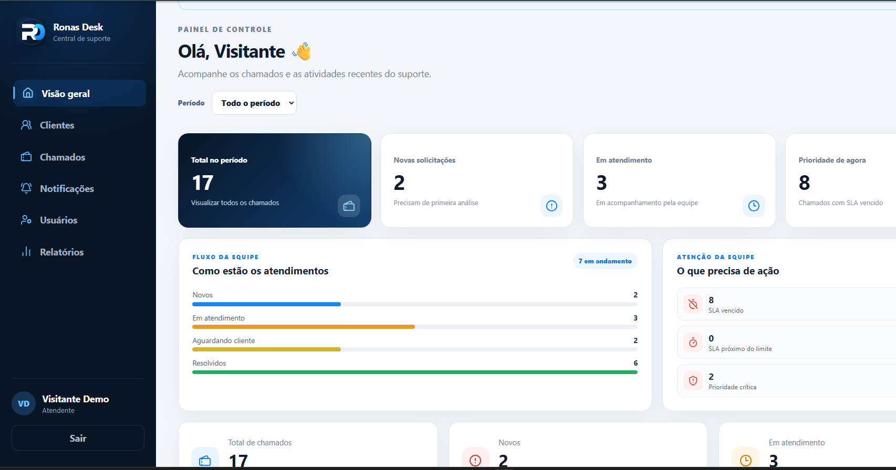

# Ronas Desk

Sistema Full Stack de gerenciamento de chamados técnicos, construído para representar um cenário real de operação de suporte.

O objetivo não foi apenas criar CRUDs, mas implementar autenticação, autorização, SLA, auditoria, anexos, relatórios, testes automatizados e execução em produção.

## Demonstração

[Abra a aplicação](https://ronas-desk.onrender.com) e selecione **Acessar demonstração** na tela de login. O ambiente usa dados fictícios e modo somente leitura.



## O que este projeto demonstra

- Desenvolvimento Full Stack com React, Node.js, Express e MySQL
- Implementação de regras de negócio além de CRUD
- Autenticação JWT e controle de permissões
- SLA, primeira resposta, auditoria e histórico estruturado
- Upload privado de anexos
- Dashboard e relatórios operacionais
- Testes automatizados e integração contínua
- Docker, Nginx e deploy de demonstração

## Funcionalidades principais

- Clientes, usuários e chamados
- Categorias, prioridades, status e responsáveis
- Busca, filtros, ordenação e paginação
- Comentários, notas internas e histórico
- SLA, tempo de resolução e primeira resposta
- Dashboard e relatórios com exportação CSV
- Anexos de imagens e PDFs
- Exclusão lógica e proteção de ações no modo demonstração

## Decisão técnica em destaque

Uma atualização de chamado pode alterar status, responsável e prioridade ao mesmo tempo. Em vez de registrar apenas uma mensagem genérica, o projeto mantém eventos estruturados por tipo.

O serviço de histórico compara valores anteriores e novos, evita eventos quando não houve mudança e compartilha o executor da transação do chamador. Os testes verificam mudanças de status, prioridade e responsável, ausência de duplicação e propagação de falhas.

Essa abordagem melhora a rastreabilidade sem afirmar que o histórico seja uma auditoria inviolável. O projeto continua sendo uma demonstração com dados fictícios e sem métricas comerciais ou de escala comprovada.

## Arquitetura

```text
React
  │
  ▼
API REST (Express)
  │
  ├── Rotas e middlewares
  ├── Controllers
  ├── Models ──────────────► MySQL
  └── Serviço de anexos ───► Cloudinary
```

## Stack

**Frontend**
- React 19
- Vite
- Axios
- SweetAlert2
- Lucide React
- Vitest + Testing Library

**Backend**
- Node.js
- Express 5
- MySQL2
- JWT
- bcryptjs
- Cloudinary
- Multer

**Infraestrutura e qualidade**
- Docker Compose
- Nginx
- GitHub Actions
- ESLint
- Prettier
- Node Test Runner

## Testes e CI

O projeto possui **370 testes automatizados**:

- **307 testes unitários de backend**, executados no CI
- **9 testes de integração de backend**, executados localmente contra MySQL real
- **54 testes de frontend**, executados no CI com Vitest + Testing Library

Total: **316 testes de backend + 54 de frontend = 370**.

Os testes de integração não rodam no CI atualmente porque dependem de um serviço MySQL disponível no ambiente. O workflow também executa lint e build do frontend.

## Segurança

- JWT para autenticação
- bcrypt para senhas
- Rotas protegidas por autorização
- Helmet e limites de requisição
- Rate limit no login
- Sessão de demonstração somente leitura
- Anexos protegidos por autenticação
- Segredos mantidos em variáveis de ambiente
- Healthcheck sem exposição de detalhes internos

## Executar localmente

### Pré-requisitos

- Node.js
- npm
- MySQL 8+

### Backend

```bash
cd backend
npm install
npm run dev
```

### Frontend

```bash
cd frontend
npm install
npm run dev
```

A API roda em `http://localhost:3001` e o frontend em `http://localhost:5173`.

### Docker

```bash
docker compose up --build -d
```

Para detalhes de configuração de ambiente, migrations, Cloudinary e deploy, consulte os arquivos e scripts do repositório.

## Status

**v1.0.0 — estável e em produção para demonstração.**

O ambiente publicado é destinado a portfólio e demonstração, não a operação crítica ou de alto tráfego.

## Autor

**Ronael Moura — Desenvolvedor Full Stack**

- [GitHub](https://github.com/ronaelmoura)
- [LinkedIn](https://www.linkedin.com/in/ronael-moura)
- [Portfólio](https://ronaelmoura.github.io/portfolio-ronael-moura/)

---

<div align="center">

**Ronas Desk** · v1.0.0 · 370 testes automatizados

</div>
